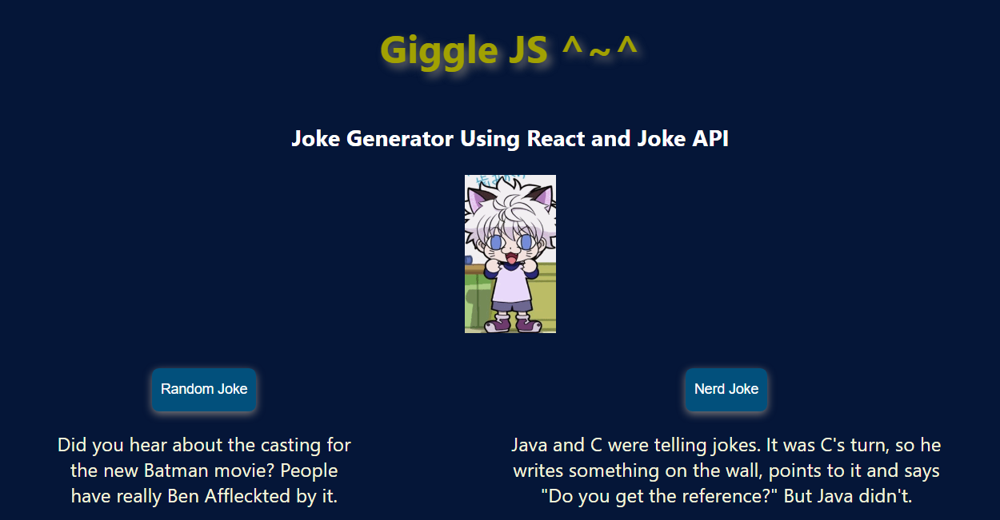

# Giggle-Js

**Giggle-Js** is a web application created with ReactJs and Joke APIs that allow you to generate a random joke ater pressing the button of your choice.

## User Stories

The following functionalities are completed:

- [x] User can click a button to generate a joke.
- [x] When button is clicked, the joke is displayed.

## Demo

Here's a demo of implemented user stories:

## Open-source libraries used

- [React](https://react.dev/)
- [Npm](https://www.npmjs.com/)
- [JokeAPI](https://jokeapi.dev/)
- [API Ninjas](https://api-ninjas.com/)

## Available Scripts

In the project directory, you can run:

### `npm start`

Runs the app in the development mode.\
Open [http://localhost:3000](http://localhost:3000) to view it in your browser.

The page will reload when you make changes.\
You may also see any lint errors in the console.
